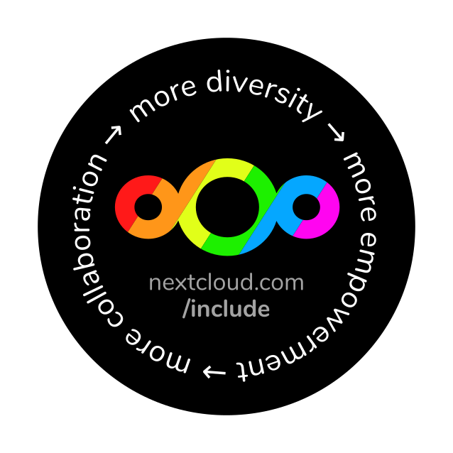

# 🌈 [Nextcloud Include](https://nextcloud.com/include/) promo

 

We generally get 45mm circular outdoor stickers: https://www.flyeralarm.com/de/shop/configurator/index/quantity/7983970#159=601&160=602&161=615&162=585

There are 3 files for each sticker:

- **.svg as source:** Has the full black background, you can just remove that to see the circular black background.
- **-mockup.png:** Just as a demo how the sticker would look like (see above).
- **.jpg for printing (300dpi, 100% quality):** Done via export of the SVG to PNG via Inkscape and then to JPG via GIMP. Yes this is not CMYK as that’s not supported in GIMP but I’ve been doing all stickers like that and it has been fine. If you know how to do it in CMYK, the source file is there and I’d love to know how. :)
