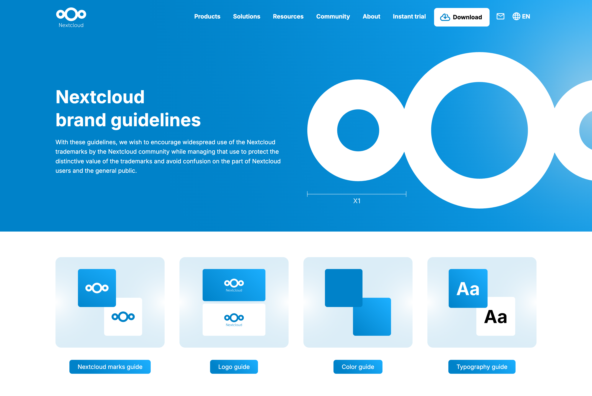
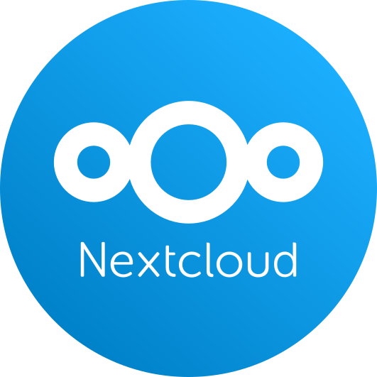

# 🎉 Nextcloud promo material

**This repository is archived.**

**The most up-to-date Nextcloud brand assets and guidelines are available at [nextcloud.com/brand](https://nextcloud.com/brand/)**

---

Nextcloud promotion material like logos, sticker templates, flyers and presentation slides. Everyone is welcome to print material and present Nextcloud at events – everyone in the community can help! :)

Please do keep in mind our [trademark guidelines.](https://nextcloud.com/trademarks/) You are not allowed to use our logo or any of our materials including logo or screenshots in any commercial offering unless you have explicit written permission from Nextcloud GmbH.

## Logo

The logo is white on light blue (#0082c9). For printing we use [Pantone 285 C](https://www.pantone.com/color-finder/285-C) (CMYK 90/48/0/0). The name »Nextcloud« can be optionally left out though.

The typeface of the logo (or similar ones) should not be used anywhere else. Instead use [Open Sans](https://en.wikipedia.org/wiki/Open_Sans), in regular weight. Use bold sparingly and only for selected emphasis.

There are several variations of our logo. In general use the one above but in a very small space (think a small avatar or 16x16 icon) use the version without text.

In a large space, think 150x150 pixels or larger, you can use the version with the background (which is at 10% opacity on the Nextcloud blue). Last but not least, if a blue background is really inappropriate, use the version with blue logo and text on white. This is NOT the preferred logo but a fallback! On a colored or black background where you can't use blue, use the white version of the logo.

## Sticker

Stickers are outdoor foil, 45mm circular – printing file is in [Sticker/sticker-45mm.png](Sticker/sticker-45mm.png). We always order through [Flyeralarm (German)](https://www.flyeralarm.com/de/shop/configurator/index/quantity/7983966#159=601&160=602&161=615&162=585) and usually get a batch of 2500 for around 70 €.

## Shirt

Shirts are light blue with simple white logo print centered on the chest. In the past we used EarthPositive EP03 slim-fit ordered through [Black Star Cotton (German)](http://www.cotton.de/hersteller/earthpositive/ep03-mens-slim-fit-shirt/) and the shirts were really good. Regarding size distribution, we ordered 50 consisting of: 6 S, 16 M, 17 L, 8 XL, 3 XXL – which turned out well. Shirts and print combined cost about 7 € per shirt.

## Presentations

You will find presentation slides and templates in the `Presentations` subfolder.
