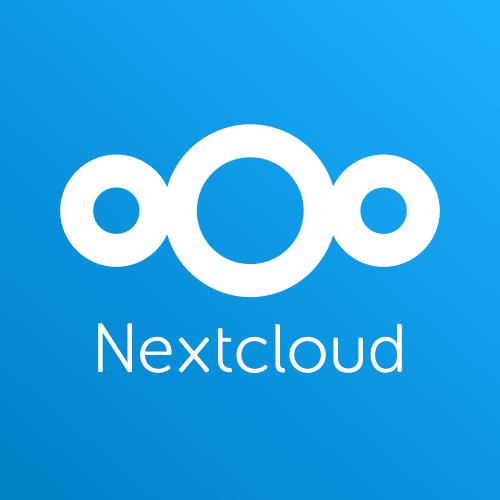

# :tada: Nextcloud promo material

Nextcloud promotion material like logos, sticker templates, flyers and presentation slides. Everyone is welcome to print material and present Nextcloud at events – permission is not needed, everyone in the community can help! :)

## Logo

The logo is white on light blue (#0082c9, C210 M115 Y4 K0 or 100%,49%,21%,0%, [Pantone Process Blue C](https://www.pantone.com/color-finder/Process-Blue-C)). The name »Nextcloud« can be optionally left out though.

The typeface of the logo (or similar ones) should not be used anywhere else. Instead use [Open Sans](https://en.wikipedia.org/wiki/Open_Sans), in light weight (not regular!). Use semibold (not bold!) sparingly and only for selected emphasis.

## Sticker

Stickers are outdoor foil, 45mm circular. We always order through [Flyeralarm (German)](http://www.flyeralarm.com/de/shop/configurator/index/id/34/aufkleber-outdoor.html#159=582&160=583&161=615&162=585) and usually get a batch of 2500 for around 70 €.

## Shirt

Shirts are not printed yet, but would be light blue with simple white logo print centered on the chest. In the past we used EarthPositive EP03 slim-fit ordered through [Black Star Cotton (German)](http://www.cotton.de/hersteller/earthpositive/ep03-mens-slim-fit-shirt/) and the shirts were really good. Regarding size distribution, we ordered 50 consisting of: 6 S, 16 M, 17 L, 8 XL, 3 XXL – which turned out well. Shirts and print combined cost about 7 € per shirt.

## Presentations

You will find presentation slides and templates in the presentation sub folder.
